<p align="center">
  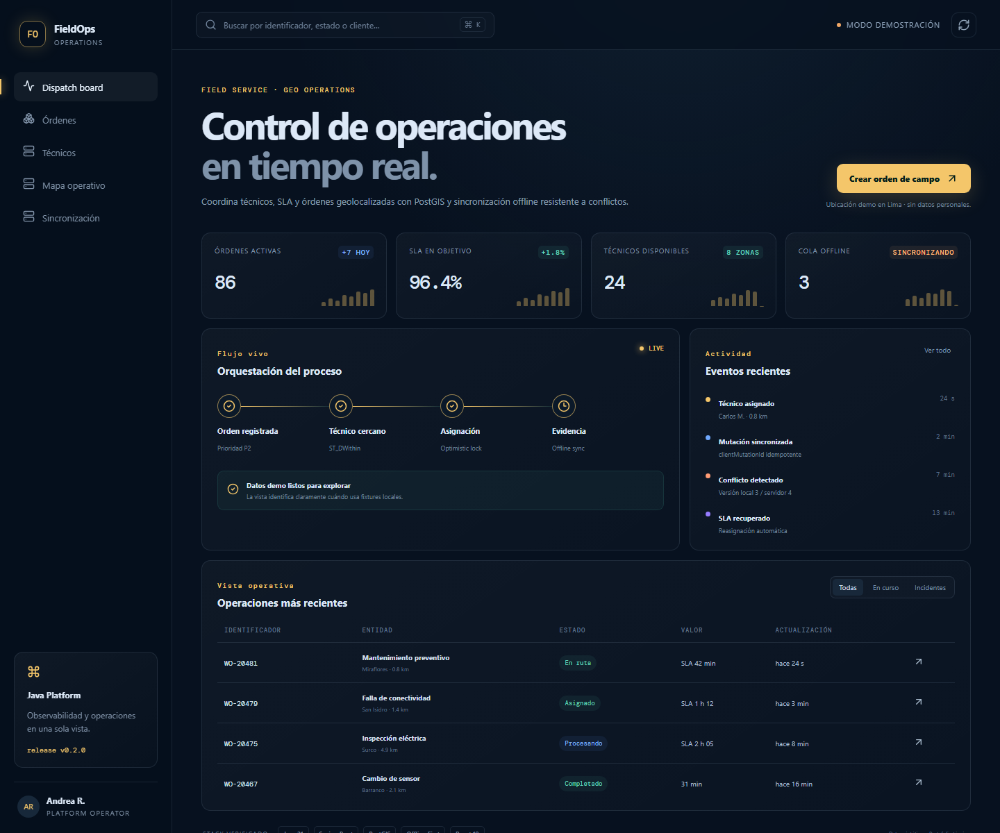
</p>

<h1 align="center">FieldOps Service Platform</h1>

<p align="center"><i>Órdenes de campo geolocalizadas, técnicos cercanos y
sincronización offline con conflictos explícitos.</i></p>

<p align="center">
  <a href="https://github.com/danielyatacoblas/fieldops-service-platform/actions/workflows/ci.yml"></a>
  
  
  
  
  
  
  <a href="LICENSE"></a>
</p>

---

## Qué es

En una operación de mantenimiento, el técnico más cercano puede quedarse sin
señal, completar una visita y sincronizar cuando otro operador ya reasignó la
orden. Ocultar ese conflicto produce pérdida de evidencia o estados imposibles.

**FieldOps modela la coordinación completa:** registra técnicos y ubicación,
busca disponibilidad por distancia real con PostGIS, asigna órdenes y recibe
mutaciones móviles idempotentes con versión esperada. Cuando el dispositivo
trabajó sobre una versión antigua, la API responde un conflicto útil en vez de
sobrescribir silenciosamente.

---

## Probar la consola sin backend

```bash
git clone https://github.com/danielyatacoblas/fieldops-service-platform.git
cd fieldops-service-platform/frontend
npm ci
npm run dev
```

Abrir `http://localhost:5175`. La consola usa ubicaciones, nombres y órdenes
sintéticas y señala el modo demostración mientras la API no esté en `8091`.

---

## Funcionalidades

1. Alta y actualización de técnicos con coordenadas geográficas.
2. Búsqueda de técnicos disponibles dentro de un radio expresado en metros.
3. Creación, asignación y transición de órdenes de trabajo.
4. Mutaciones offline con `clientMutationId` idempotente.
5. Control optimista mediante versión esperada.
6. Respuesta de conflicto que entrega versión local y versión del servidor.
7. Persistencia PostgreSQL/PostGIS con migraciones Flyway.
8. Health, Prometheus, Docker, CI y consola de despacho responsiva.

---

## Capturas

| Pantalla | Claro | Oscuro |
|---|---|---|
| Dispatch board | 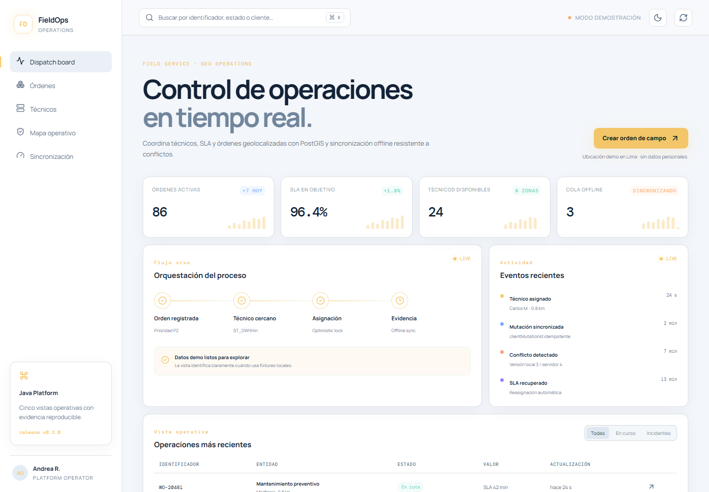 | 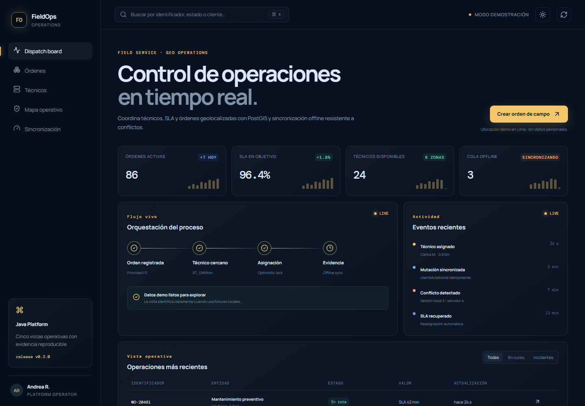 |
| Órdenes | 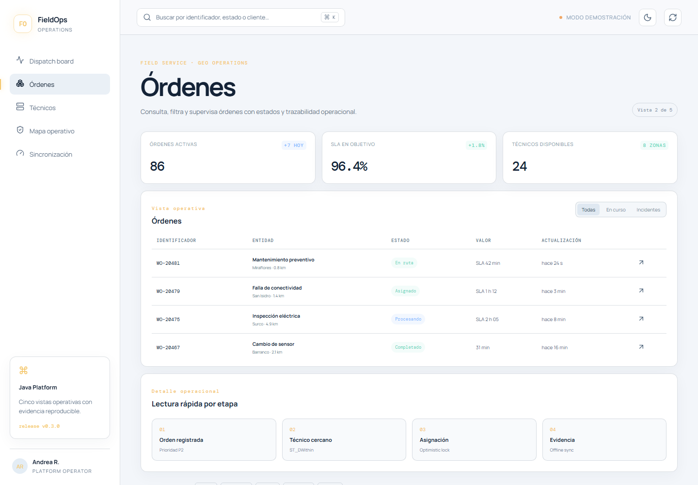 | 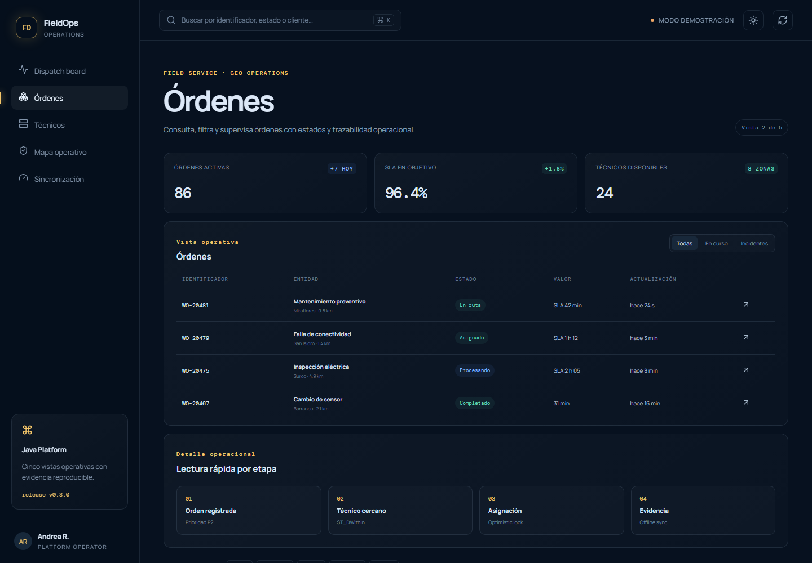 |
| Técnicos | 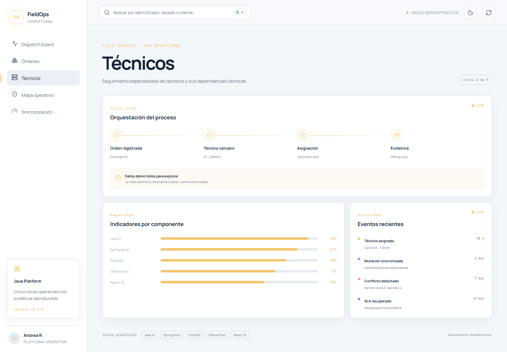 | 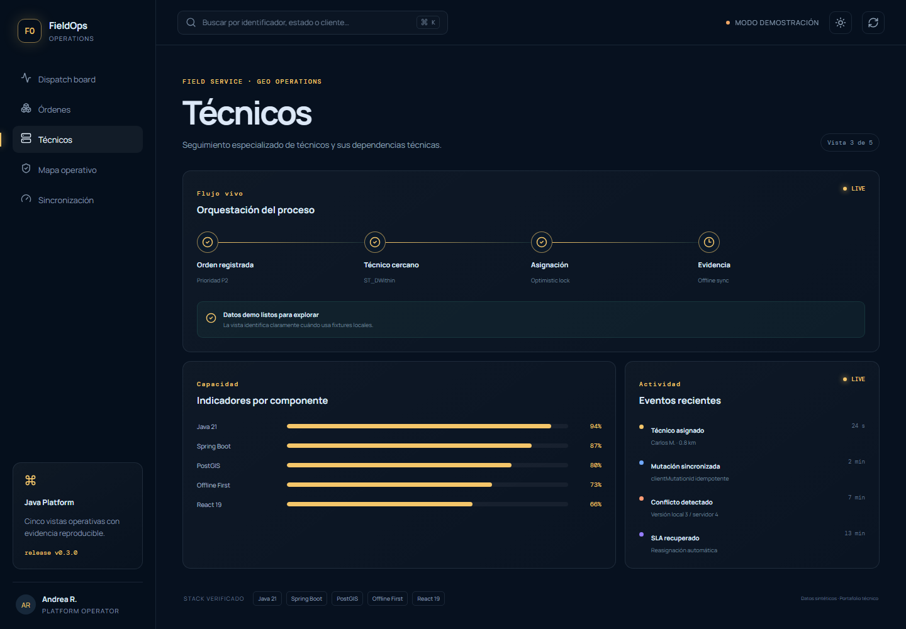 |
| Mapa operativo | 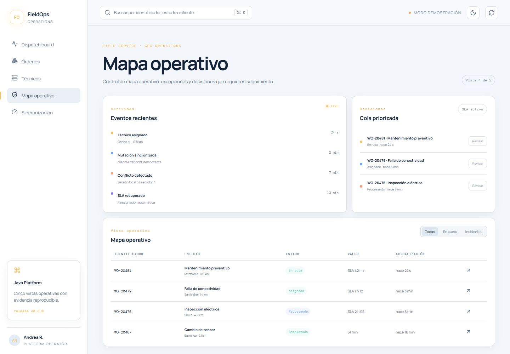 | 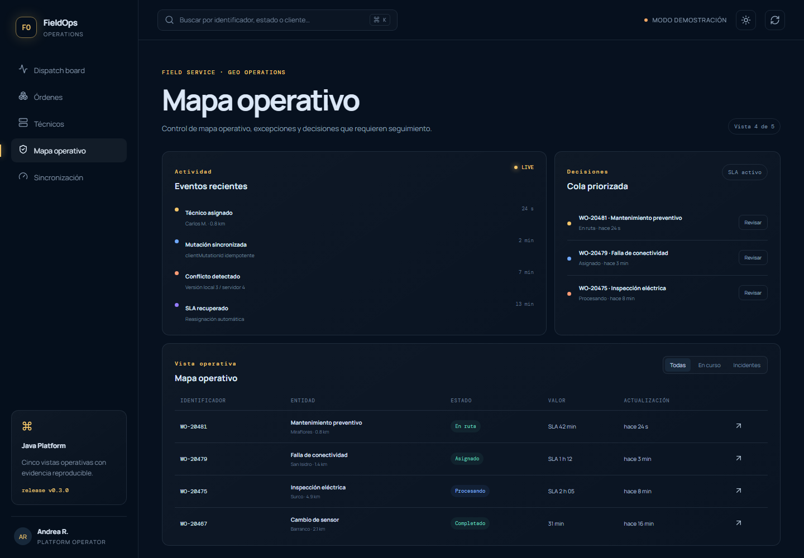 |
| Sincronización | 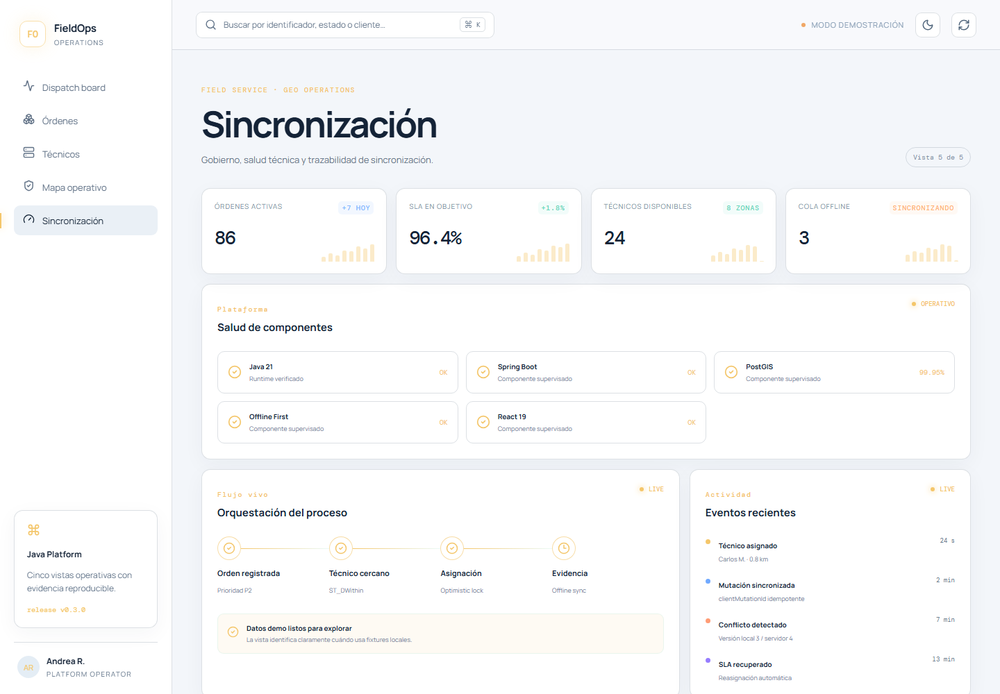 | 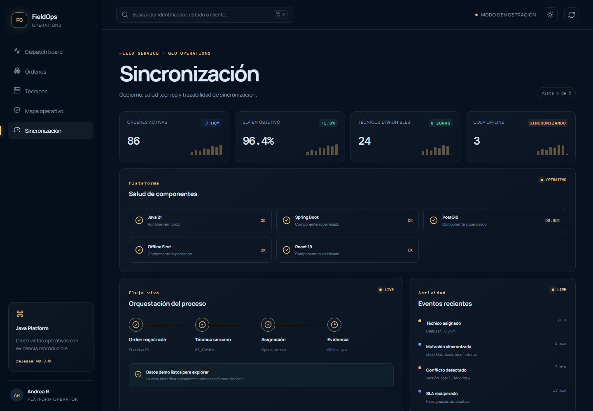 |

<p align="center">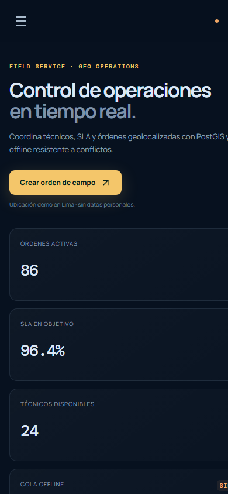</p>

---

## Arquitectura y flujo

<p align="center">
  
</p>

<p align="center">
  
</p>

Las fuentes Mermaid se versionan en [`diagrams/`](diagrams) y se regeneran
con `pwsh scripts/render-diagrams.ps1`.

---

## Decisiones de diseño

- **PostGIS calcula distancia**, evitando aproximaciones manuales sobre
  latitud/longitud.
- **Las unidades llegan como metros** desde la API y se convierten una sola vez
  en la consulta geoespacial.
- **`clientMutationId` identifica la intención móvil**, por lo que un retry de
  red devuelve el resultado existente.
- **La versión esperada no se corrige automáticamente:** un 409 hace visible
  que alguien modificó la orden.
- **El backend conserva la autoridad del workflow** aunque la aplicación móvil
  pase horas desconectada.

Los motivos completos están en [los ADR](docs/README.md).

---

## Instalación y demo completa

Requiere Java 21, Docker y Node.js 24.

```bash
docker compose up -d
./gradlew bootRun
```

La API escucha en `http://localhost:8091`.

```bash
curl -X PUT http://localhost:8091/api/v1/technicians/11111111-1111-1111-1111-111111111111 +  -H "Content-Type: application/json" +  -d '{"name":"Técnico Demo","latitude":-12.0464,"longitude":-77.0428,"available":true}'

curl "http://localhost:8091/api/v1/technicians/nearby?latitude=-12.05&longitude=-77.04&radiusMeters=5000"

curl -X POST http://localhost:8091/api/v1/work-orders +  -H "Content-Type: application/json" +  -d '{"summary":"Inspección preventiva","latitude":-12.0464,"longitude":-77.0428}'
```

---

## API

| Método | Ruta | Uso |
|---|---|---|
| `PUT` | `/api/v1/technicians/{id}` | Ubicación y disponibilidad |
| `GET` | `/api/v1/technicians/nearby` | Búsqueda geoespacial |
| `POST` | `/api/v1/work-orders` | Crear orden |
| `GET` | `/api/v1/work-orders/{id}` | Consultar orden y versión |
| `POST` | `/api/v1/sync/mutations` | Sincronizar cambios offline |

---

## Pruebas, comandos y stack

```bash
./gradlew clean test
cd frontend && npm ci && npm test && npm run build
```

| Comando | Resultado |
|---|---|
| `docker compose up -d` | PostgreSQL con PostGIS |
| `./gradlew bootRun` | API en el puerto 8091 |
| `./gradlew clean test` | Integración geoespacial y offline |
| `npm test` | Consola y modo degradado |
| `pwsh scripts/verify.ps1` | Verificación integral |

| Capa | Tecnología |
|---|---|
| Backend | Java 21, Spring Boot 4.1 |
| Datos | PostgreSQL, PostGIS, Flyway, JPA |
| Concurrencia | Optimistic locking e idempotencia |
| Observabilidad | Actuator, Prometheus |
| Frontend | React 19, TypeScript 7, Vite 8 |
| Pruebas | Spring Boot Test, Testcontainers, Vitest |

---

## Flujo de trabajo con Git

El gráfico muestra el historial real hasta `v0.3.0`, incluyendo feature, fix,
hotfix, documentación, releases, tags y merges de retorno.

<p align="center">
  
</p>

`main` conserva releases etiquetadas; `develop` integra; `feature/*`,
`docs/*`, `fix/*`, `hotfix/*` y `release/*` separan cada intención.
Los merges son `--no-ff` y los commits siguen Conventional Commits.

---

## Estructura

```text
fieldops-service-platform/
├── src/main/java/              # Dominio, persistencia y API
├── src/main/resources/         # Configuración y SQL PostGIS
├── src/test/                   # Integración con PostgreSQL real
├── frontend/                   # Consola React
├── docs/adr/                   # Proximidad y conflictos offline
├── docs/screenshots/           # Evidencia desktop/móvil
├── diagrams/                   # Arquitectura, flujo y GitFlow
├── scripts/                    # Verificación y render
├── compose.yaml                # PostGIS local
└── .github/workflows/ci.yml    # CI backend + frontend
```

---

## Autor

[Daniel Yataco Blas](https://github.com/danielyatacoblas) — autor principal
del diseño, implementación, pruebas y documentación.

## Licencia

[MIT](LICENSE) · Daniel Yataco Blas
